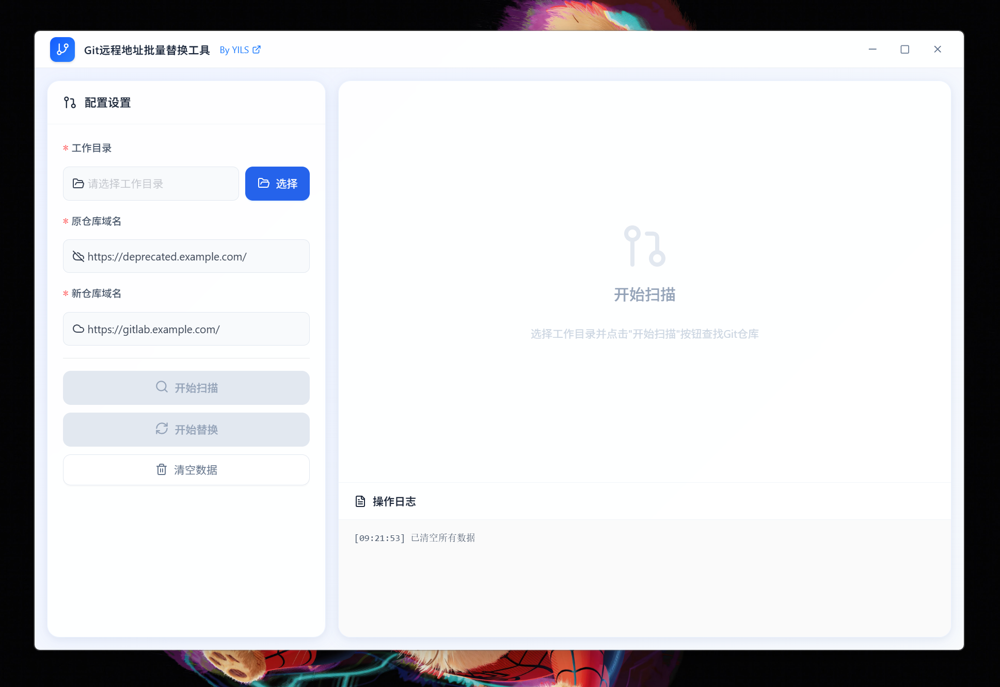

# 🔄 Git Remote URL Batch Replacer (Git远程地址批量替换工具)

> 一个基于 Tauri (Rust + TypeScript) 构建的高性能、高颜值 Git 远程地址批量管理工具。

## 📖 简介 / Introduction

起因是公司最近更换了 GitLab 域名，面对几十个本地仓库，手动修改 `git remote` 地址既繁琐又容易出错。

为了解决这个问题，我花了 5 个小时写了这个工具。借助于 Rust 的高性能和 Tauri 的小体积，最终打包出的单文件仅 **9MB**，且无需安装环境，开箱即用。

## ✨ 特性 / Features

- **🚀 极速扫描**：自动识别工作目录下的所有 Git 仓库，利用 Rust 多线程优势，速度飞快。
- **⚡️ 批量替换**：一键将旧域名/IP 替换为新地址，支持端口号保留或修改。
- **🛡 安全可靠**：替换前提供清晰的预览和确认弹窗，操作日志实时记录，确保数据安全。
- **📦 轻量便携**：基于 Tauri 构建，Windows 单文件 exe 仅 9MB，内存占用极低。
- **🎨 现代化 UI**：简洁美观的界面设计，操作直观。

## 🛠️ 技术栈 / Tech Stack

- **Core**: Rust (Tauri Backend)
- **UI**: TypeScript + React
- **AI 辅助**: 核心逻辑与 Rust 借用检查器的“搏斗”由 AI 辅助完成，开发体验极佳。

## 📸 截图 / Screenshots

## 📥 下载 / Download

前往 [Releases](https://github.com/YILS-LIN/git-remote-replacer/releases) 页面下载最新版。

## License

MIT
